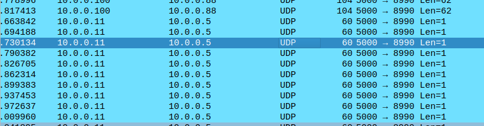
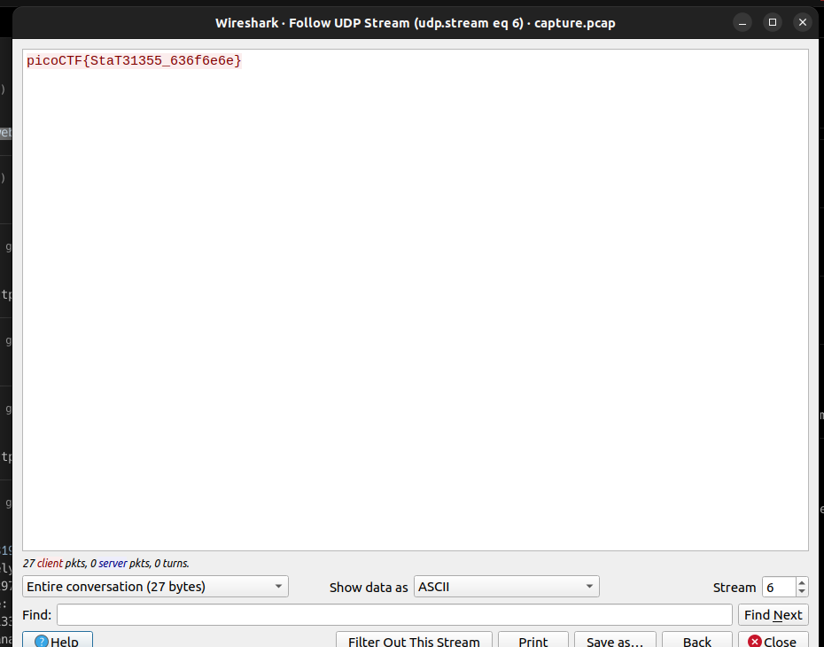

# Streams

It was a picoCTF challenge which taught about how streams in tcp/udp communications.

When analyzing network traffic, tools like Wireshark can represent TCP and UDP communications as "streams." This helps in reassembling and inspecting the flow of data between endpoints.

**TCP Stream Analysis**: Wireshark can reassemble and display TCP streams, showing the entire conversation between two endpoints as a continuous flow of data.

**UDP Stream Analysis**: Although UDP does not guarantee order or reliability, Wireshark can group packets by their source and destination IP addresses and ports, treating them as part of the same "stream" for analysis purposes.

## TCP Stream analysis

TCP is a connection-oriented protocol, and Wireshark uses the following parameters to identify and group packets into a single TCP stream: Source IP, Destination IP, Source port number, destination number.

Wireshark keeps track of the TCP sequence numbers and acknowledgment numbers to ensure the packets are ordered correctly. It uses these parameters to group packets into a stream:

- **Stream Index**: Wireshark assigns a unique stream index to each unique combination of source and destination IP addresses and ports. This index is used to group packets that belong to the same TCP session.
- **TCP State Tracking**: Wireshark tracks the state of the TCP connection (e.g., SYN, SYN-ACK, ACK, FIN) to understand the lifecycle of the connection and properly reassemble the stream.

## UDP Stream Analysis

UDP is a connectionless protocol, so it doesn’t have the same sequence and acknowledgment numbers as TCP. Wireshark groups UDP packets into streams using a similar set of parameters(Source IP, Destination IP, port numbers, etc.)

**Stream Index**: Similar to TCP, Wireshark assigns a unique stream index to each unique combination of source and destination IP addresses and ports for UDP packets.

## Challenge Walk through

If you look at the udp packets, there are several udp packets with udp packet data length as 1. It looks fishy.

In the second hint,  **streams** was mentioned. If you follow any of the udp packet you'll find one of the udp streams and if you're lucky enough you may get the flag in the first go itself.  

However, if you don't you can change the udp streams to find the flag in the sixth udp stream. 

